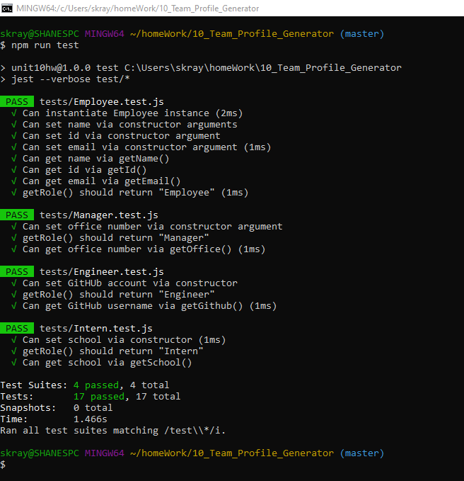

# Team-Profile-Generator

## Description 
This Node CLI builds a team-displaying HTML file for a user based on their input. The user inputs a team name, a how many members will be on their team and what their roles will be, and the program generates a static page organizing their information. 

## Images

The generated HTML page:

## Testing
This program was build using class syntax and constructor functions. The function for each employee type was tested before building out the rest of the program. 

## Installation 
Run node.js and perform an npm install to bring in all necesarry node modules. The program is run with the command "node app.js"

## Links
[Repo Link](https://github.com/smkraycs12/10_Team_Profile_Generator)

[Video Link](https://drive.google.com/file/d/1wj5pdvgLElCYS7mum5WQpfVt-cLW99vQ/view?usp=sharing)

